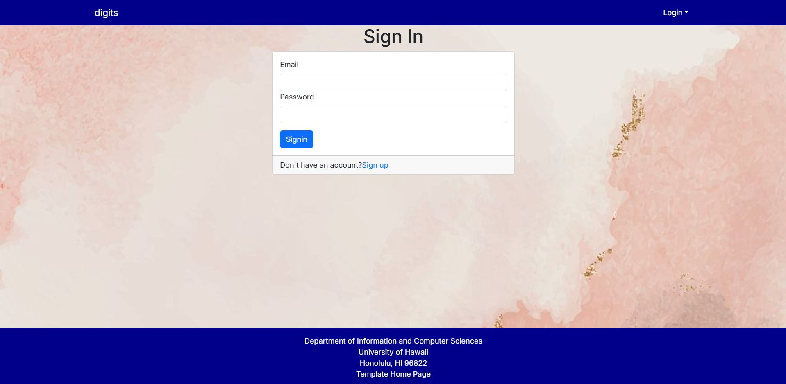
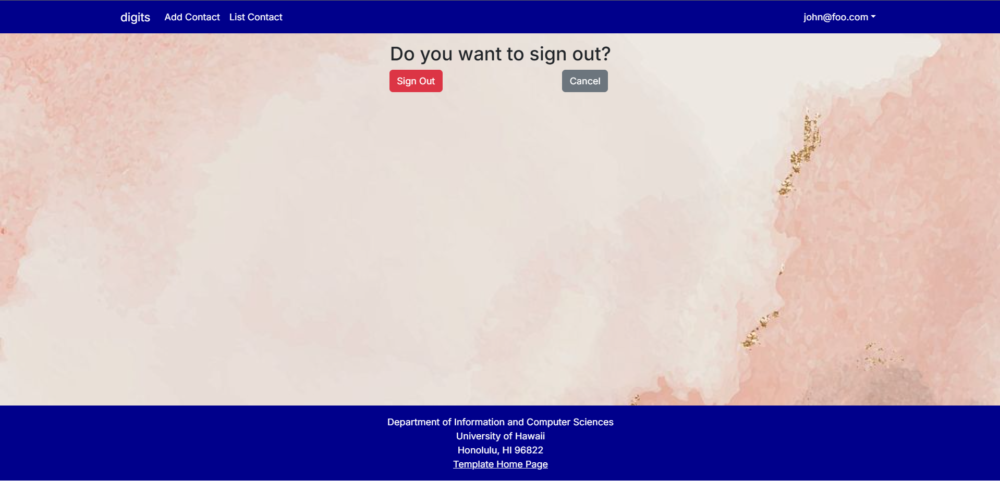

# Digits App


## Installation Instructions

To get started with the Digits application, follow these steps:

1. Clone the repository to your local machine:
    ```bash
    git clone https://github.com/your-username/digits.git
    ```

2. Install the necessary dependencies:
    ```bash
    cd digits
    npm install
    ```

3. Set up the database:
    - Ensure you have a PostgreSQL database installed.
    - Create the database:
      ```bash
      createdb digits-db-name
      ```
    - Run migrations to set up the schema:
      ```bash
      npx prisma migrate dev
      ```

4. Seed the database with initial data:
    ```bash
    npx prisma seed
    ```

5. Run the application:
    ```bash
    npm run dev
    ```

6. Visit the app in your browser at:
    ```
    http://localhost:3000
    ```

## Pages in the Application

### 1. **Home Page**
   - Displays a welcome message and overview of the app features.
   - Provides a link to the login page for users to sign in.
   

### 2. **Login Page**
   - Users can log in using their credentials (e.g., `john@foo.com`).
   - If not registered, users are prompted to sign up.
   

### 3. **Landing After Login**
   - After login, users are directed to this page, showing an overview of their account.
   

### 4. **Change Password Page**
   - Users can change their account password.
   

### 5. **Not Authorized Page**
   - If a user tries to access a restricted area without the proper permissions, the user wil be asked to signin.
   

### 6. **Register Page**
   - New users can register for an account.
   

### 7. **Sign Out Page**
   - Users can log out from the app on this page.
   

## Managing Contacts

### 1. **View Contacts**
   - After logging in, users are able to view their contact list. This page shows a list of all contacts associated with the user.
   - Users can click on each contact to see more details, such as their name, email, phone number, etc.

   **Example of Contact List Page:**
   

### 2. **Create a New Contact**
   - To create a new contact, navigate to the "Create Contact" page.
   - Users are prompted to fill out the contact details, such as the contact's name, email, phone number, etc.
   - After submitting the form, the new contact is saved to the database and appears in the user's contact list.

   **Steps to Create a Contact:**
   1. Navigate to the “Contacts” section.
   2. Click the “Create New Contact” button.
   3. Fill in the required details (Name, Email, Phone, etc.).
   4. Click the “Save” button to add the contact.

   **Example of Create Contact Page:**
   

### 3. **Edit a Contact**
   - Users can edit existing contacts by clicking the "Edit" button next to the contact.
   - This will allow them to update any information, such as changing the phone number or email address.
   - After saving the changes, the contact’s information will be updated in the database.

   **Steps to Edit a Contact:**
   1. Navigate to the “Contacts” section.
   2. Click on the contact you want to edit.
   3. Update the contact details.
   4. Save the changes to update the contact.

   **Example of Edit Contact Page:**
   

### 4. **Add a Note with Timestamp**

When adding a new note to the contact, a timestamp is automatically captured to record when the note was added. This ensures that each note is associated with the exact time it was created in the system.

**Steps to Add a Contact with Timestamp:**
1. Go to the "Contacts" section of the application.
2. Click the “List Contact” button.
3. Under each contact there is an empty field for creating a note
4. The application automatically captures the current timestamp and records it as the "Added At" time.
5. After submitting the form, the note is saved, and the timestamp is shown alongside the note’s details.
   
   **Example of Adding a Note:**
   
---

### Credits
- Developed by [Casey](https://github.com/kmiks).
- Built with [Next.js](https://nextjs.org/), [Prisma](https://www.prisma.io/), and [PostgreSQL](https://www.postgresql.org/).

---

### License
This project is licensed under the MIT License - see the [LICENSE](LICENSE) file for details.
